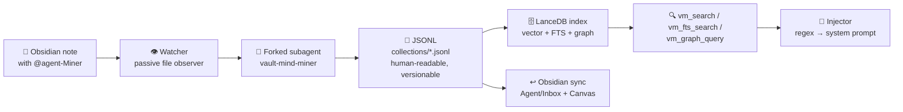

# toxic-vault-mind

> **Your Obsidian vault, with a memory.** Drop an `@agent` marker in any note — five specialist subagents research, extract, and index it into a local hybrid-search knowledge base. No chat pollution, no manual triggers, no cloud.

<div align="right">

[](https://www.npmjs.com/package/toxic-vault-mind)
[](LICENSE)
[](https://github.com/mariozechner/pi)
[](#security)

</div>

## Why you should care

Most agent knowledge dies in chat logs. **toxic-vault-mind** is a passive memory layer for the [pi](https://github.com/mariozechner/pi) agent ecosystem: it watches your Obsidian vault, dispatches forked subagents on `@agent` markers, and stores everything in **JSONL you can read** (version-control friendly) plus a **LanceDB index** (vector + FTS + graph) that's fully rebuildable. All local — no external binaries, no SaaS, offline-capable embeddings.

**Who it's for:** Obsidian users running pi agents who want a durable, searchable, agent-written knowledge base instead of ephemeral chat.

**Security posture (up front):** everything runs on your machine. The JSONL source-of-truth lives in your vault, the LanceDB index is derived, embeddings default to a local offline model, and config is vault-local (`<vault>/.vault-mind/` — never a shared global file). The optional Modal provider is **bring-your-own deploy** to your own Modal account — there is no shared hosted endpoint, and its tokens stay yours.

> **Legacy note:** looking for the ledger-first predecessor? See [toxicwind/pi-qmd-ledger](https://github.com/toxicwind/pi-qmd-ledger). This project was renamed twice: `pi-qmd-ledger` → `pi-knowledge-store` → `toxic-vault-mind`.

## Features

- **Passive file watcher** — write `@agent-Miner` in any note and save. The watcher detects the marker, groups by role, and dispatches isolated subagent forks. "Drop & forget."
- **Five specialist agents** — `vault-mind-{role}` skills: **Manager** (interactive orchestrator), **Miner** (research + entity extraction), **Broadcaster** (NotebookLM podcasts/study guides/decks), **Heavy-Lifter** (external delegation, git-worktree refactors), **Watcher** (the passive observer).
- **Hybrid search** — semantic vector (LanceDB) + exact keyword (Tantivy BM25) + entity graph traversal (BFS). One query, three signals.
- **JSONL source-of-truth** — every fact is a human-readable line in `collections/*.jsonl`. The LanceDB index is derived and rebuildable via `/vm reindex --all --reembed`.
- **Tiered HITL** — `vm_append` runs in strict / gated / autopilot modes.
- **Context injection** — regex injectors pre-fetch collection entries into prompts (`draft login` → matching entries land in the system prompt automatically).
- **Bidirectional Obsidian sync** — substantial entries auto-write to `Vault/Agent/Inbox/`; graph entities render as Obsidian Canvas.
- **Vault-scoped config** — setup lives under `<vault>/.vault-mind/`; `/vm setup` wizard for interactive config, CLI flags for scripting.

## How it works



## Quick start

```bash
pi install npm:toxic-vault-mind        # or: pi -e npm:toxic-vault-mind (try without installing)
```

Then inside pi:

```
/vm setup
```

Start using it:

```
vm_append(collection="main", mode="autopilot",
  entry={"id":"1","domain":"auth","fact":"JWT tokens expire after 1 hour","tag":"security"})
vm_search(collection="main", query="token expiry")
```

**Prerequisites:** Node.js 20+. Embedding provider — pick one: `@xenova/transformers` (built-in, all-MiniLM-L6-v2, offline), `ollama` (needs Ollama + `embeddinggemma`, higher quality), or `modal` (optional self-hosted GPU tier — deploy the embedding service to your own Modal account and point the extension at your URL + token).

> **On the Modal provider:** local providers work for everyone with zero infrastructure — that's the default. `modal` is an optional self-hosted tier: you deploy your own copy of the embedding service to your own Modal account and point the extension at *your* URL + token. No shared endpoint exists. Remote bulk re-index: `/vm reindex --all --reembed --remote`.

## Architecture

```
┌─────────────────────────────────────────┐
│  Obsidian vault (any directory)          │
│  @agent-{role} markers in notes          │
└──────┬──────────────────────────────────┘
       │  save file
       ▼
┌─────────────────────────────────────────┐
│  Watcher — passive file observer         │
│  groups markers by role                  │
└──────┬──────────────────────────────────┘
       │  fork isolated subagent
       ▼
┌─────────────────────────────────────────┐
│  vault-mind-{role} skills                │
│  manager · miner · broadcaster ·         │
│  heavy-lifter · watcher                  │
└──────┬──────────────────────────────────┘
       │  vm_append (dual-write)
       ▼
┌─────────────────────────────────────────┐
│  JSONL WAL — collections/*.jsonl        │
│  durable · human-readable · versionable  │
│       │ auto-embed on append             │
│       ▼                                  │
│  LanceDB (.lancedb/)                    │
│  vector search + Tantivy FTS + graph     │
│       │ graph extraction                 │
│       ▼                                  │
│  Graph tables (entities + relations)    │
│  entity linking + BFS traversal          │
└─────────────────────────────────────────┘
```

Data flow in one line: **marker → fork → JSONL → embed → LanceDB → search/inject/sync**.

### Tools (LLM-accessible)

| Tool | Purpose | Search type |
|---|---|---|
| `vm_search` | Semantic vector search | Vector (cosine) |
| `vm_fts_search` | Exact keyword search | Tantivy BM25 |
| `vm_graph_query` | Entity relationship traversal | Graph BFS |
| `vm_query` | Deterministic JSONL search | Substring + exact filters |
| `vm_append` | Dual-write: JSONL + LanceDB | Insert with auto-embed |
| `vm_status` / `vm_stats` / `vm_describe` | Table health, dashboard, schema introspection | Metadata |
| `vm_configure` | Read/update config at runtime | Config |
| `vm_export` | Export to JSON/CSV/Markdown | Read |
| `vm_promote` | Stage cross-collection promotions | Write |

### Commands

| Command | Purpose |
|---|---|
| `/vm setup` | Interactive vault-local setup wizard (also CLI/scriptable) |
| `/vm init` | Scaffold config + collections |
| `/vm validate` | Health-check LanceDB, config, collection paths |
| `/vm approve [collection]` | Batch-review pending entries |
| `/vm reindex [--all] [--reembed] [--remote]` | Rebuild FTS + vector indexes |
| `/vm collection select \| create` | Manage collections (wizard available) |
| `/vm injector create` | Create a context injector (wizard) |
| `/vm embedding status \| use \| model \| models \| pull` | Embedding provider management |
| `/vm watcher start \| stop \| status` | Manage the passive file watcher |
| `/vm server status` | HTTP server health + port |
| `/vm context status \| enable \| disable` | pi-context integration |
| `/vm remote status \| config \| sync \| jobs \| migrate` | Remote embedding + vector sync |

Full reference: [`skills/vault-mind/SKILL.md`](skills/vault-mind/SKILL.md) (Manager skill) and [`skills/vault-mind/references/tool-reference.md`](skills/vault-mind/references/tool-reference.md).

## Config

Vault-local surface — everything lives under `<vault>/.vault-mind/`:

```jsonc
// <vault>/.vault-mind/vault-mind.config.json
{
  "version": 2,
  "collections": {
    "main": {
      "path": "collections/main.jsonl",
      "schema": ["id", "domain", "source", "fact", "tag", "artifact"],
      "dedupField": "fact"
    }
  },
  "injectors": [
    {
      "name": "draft-context",
      "regex": "draft\\s+(\\S+)",
      "collection": "main",
      "filterField": "tag"
    }
  ],
  "vaultMind": {
    "dataDir": ".lancedb",
    "embedding": {
      "remoteUrl": "http://127.0.0.1:11434",
      "model": "embeddinggemma",
      "dim": 768
    },
    "ftsEnabled": true,
    "graph": { "enabled": true, "canvasSync": false }
  }
}
```

An annotated example ships at [`pi-vault-mind.config.example.json`](pi-vault-mind.config.example.json). Re-run `/vm setup` anytime to view or change settings; the Obsidian plugin's setup wizard writes the same vault-local surface.

### Obsidian integration (optional but recommended)

toxic-vault-mind works on any directory; the full Obsidian experience needs a few pieces on the Obsidian side:

| Plugin | Install ID | Why |
|---|---|---|
| **obsidian-git** | `obsidian-git` | Auto-commits vault changes; Heavy-Lifter uses git worktrees |
| **Breadcrumbs** | `obsidian-breadcrumbs` | Renders typed edges (`agent:related-to`) from frontmatter |
| **Graph Analysis** | `graph-analysis` | Co-citation discovery on the native graph |
| **Actions URI** | `actions-uri` | Lets the Manager trigger Obsidian UI commands from pi |
| **Vault Mind plugin** | `obsidian-toxic-vault-mind` | Native setup/status/chat UI + HTTP bridge (see [`packages/obsidian/`](packages/obsidian/)) |

Install via the [official Obsidian CLI](https://help.obsidian.md/cli) (`obsidian plugin:install id=<id> enable`), or use [notesmd-cli](https://github.com/Yakitrak/notesmd-cli) when Obsidian isn't running. Headless/mobile flows, BRAT betas, and the `kepano/obsidian-skills` pi-skill set are documented in the repo's skill references (`skills/vault-mind-setup/`).

## Repository map

| Path | What it is |
|---|---|
| [`skills/`](skills/) | pi skills: `vault-mind` (Manager), `vault-mind-miner`, `vault-mind-broadcaster`, `vault-mind-heavy-lifter`, `vault-mind-manager`, `vault-mind-setup`, Obsidian plugin helpers |
| [`agents/`](agents/) | Agent definitions: manager, miner, broadcaster, heavy-lifter, main, personalization |
| [`packages/obsidian/`](packages/obsidian/) | Native Obsidian plugin (setup wizard, status/chat UI, HTTP bridge) |
| [`packages/obsidian-ui/`](packages/obsidian-ui/) | Plugin UI components |
| [`scripts/`](scripts/) | E2E harnesses, config generators, vault setup/reset, Modal smoke tests |
| [`pi-vault-mind.config.example.json`](pi-vault-mind.config.example.json) | Annotated config example |
| [`config-keys.json`](config-keys.json) · [`extension-packages.json`](extension-packages.json) | Generated config-key and package manifests |
| [`CHANGELOG.md`](CHANGELOG.md) | Version history (current: **0.16.25**) |

## Development & contributing

```bash
npm install        # install deps
npm run build      # build to dist/
npm test           # run tests
```

Release flow is codified in [`skills/pi-vault-mind-release/SKILL.md`](skills/pi-vault-mind-release/SKILL.md); Obsidian plugin publishing via [`scripts/publish-obsidian-plugin.sh`](scripts/publish-obsidian-plugin.sh). E2E coverage lives in `scripts/` (`cli-e2e.mjs`, `e2e-commands.mjs`, `configuration-e2e.mjs`, `modal-e2e-smoke.mjs`); reset a test vault with `scripts/reset-test-vault.sh`.

## License & security

**MIT** — © 2026 Kyle Brodeur. See [LICENSE](LICENSE).

- **Local-first:** your facts stay in your vault (`collections/*.jsonl`); the LanceDB index is derived and rebuildable.
- **Offline-capable:** default embedding provider (`@xenova/transformers`) runs with no network.
- **No shared cloud:** the Modal tier is self-hosted by you, on your account, with your tokens. Nothing phones home by default.
- **Vault-local config:** no global credential/config file shared across vaults.

---

*Built for the [pi](https://github.com/mariozechner/pi) agent ecosystem. Formerly `pi-qmd-ledger` → `pi-knowledge-store`.*
